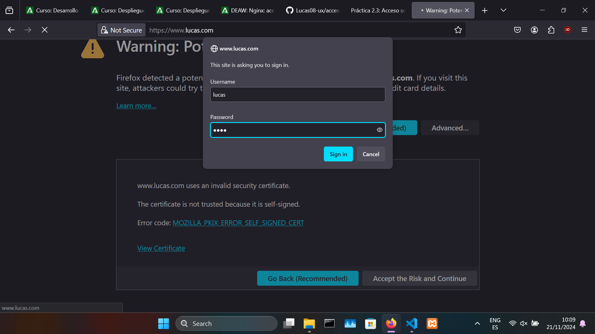

# Acceso seguro con Nginx

## Nombre del servidor
He creado el archivo lucas.conf en sites-avaliable y les he introducido los dos server names que he usado en el proyecto.

```
server_name lucas.com www.lucas.com;
```

Y por supuesto, lo he reflejado en el Vagranrfile:

```
cp -v /vagrant/lucas.com /etc/nginx/sites-available/lucas.com
    ln -s /etc/nginx/sites-available/lucas.com /etc/nginx/sites-enabled/
```

También, he modificado el archivo hosts tanto de Windows como de Debian para que los nombres y las IPs de los servidores que he usado en el proyecto se puedan encontrar en mi máquina anfitriona, que es Windows.

```
192.168.57.102	lucas.com
192.168.57.102	www.lucas.com
```

## Configuración del cortafuegos

He instalado ufw y he introducido los siguientes comandos para permitir el tráfico HTTPS y activar el cortafuegos:

```
ufw allow ssh
ufw allow 'Nginx Full'
ufw delete allow 'Nginx HTTP'

ufw --force enable
```

## Generar un certificado autofirmado

He generado un certificado autofirmado para el dominio lucas.com y he introducido el comando para que se ejecute en el servidor:

```
openssl req -x509 -nodes -days 365 \
      -newkey rsa:2048 \
      -keyout /etc/ssl/private/lucas.com.key \
      -out /etc/ssl/certs/lucas.com.crt \
      -subj "/C=ES/ST=Andalucia/L=Granada/O=IZV/OU=WEB/CN=lucas.com/emailAddress=webmaster@lucas.com"
```

## Configuración del archivo lucas.com

He configurado el archivo lucas.com que se sitúa en /etc/nginx/sites-available/lucas.com para que se haga uso del certificado SSL:

```
server {
    listen 80;
    listen 443 ssl;
    root /var/www/lucas/html;
    index index.html index.htm index.nginx-debian.html;
    server_name lucas.com www.lucas.com;
    ssl_certificate /etc/ssl/certs/lucas.com.crt;
    ssl_certificate_key /etc/ssl/private/lucas.com.key;
    ssl_protocols TLSv1 TLSv1.1 TLSv1.2 TLSv1.3;
    ssl_ciphers HIGH:!aNULL:!MD5;

    location / {
        satisfy all;
        allow 192.168.57.0/24;
        allow 127.0.0.1;
        deny all;
        
        auth_basic "Área restringida";
        auth_basic_user_file /etc/nginx/.htpasswd;

        try_files $uri $uri/ =404;
    }

    # Bloqueo de acceso a /contact.html con autenticación básica
    location /contact.html {
        auth_basic "Área restringida";
        auth_basic_user_file /etc/nginx/.htpasswd;
    }
}
```

## Vagrantfile

Aquí muestro el archivo Vagrantfile que he creado para configurar la máquina virtual con Nginx y el servidor web lucas.com:

```
# -*- mode: ruby -*-
# vi: set ft=ruby :

# All Vagrant configuration is done below. The "2" in Vagrant.configure
# configures the configuration version (we support older styles for
# backwards compatibility). Please don't change it unless you know what
# you're doing.
Vagrant.configure("2") do |config|
  config.vm.provision "shell", inline: <<-SHELL
     apt-get update
     apt-get install -y git
     apt-get install -y nginx
     apt-get install -y ufw
  SHELL

  config.vm.define "lucas" do |lucas|
    lucas.vm.box = "debian/bookworm64"
    lucas.vm.network "private_network", ip: "192.168.57.102"

    lucas.vm.provision "shell", inline: <<-SHELL

    mkdir -p /var/www/lucas
    cp -vr /vagrant/html /var/www/lucas/html
    chown -R www-data:www-data /var/www/lucas/html
    chmod -R 755 /var/www/lucas

    cp -v /vagrant/lucas /etc/nginx/sites-available/lucas
    ln -s /etc/nginx/sites-available/lucas /etc/nginx/sites-enabled/

    # Para el dominio que se usará en esta práctica
    cp -v /vagrant/lucas.com /etc/nginx/sites-available/lucas.com
    ln -s /etc/nginx/sites-available/lucas.com /etc/nginx/sites-enabled/

    cp -v /vagrant/hosts /etc/hosts

    # Para el hosts del anfitrión Windows (hay posibilidad de que no funcione por temas de permisos. En caso de no funcioar, hay queintroducir manualmente en el archivo hosts de Windows los nombres y las IPs)
    powershell.exe -ExecutionPolicy Bypass -File add_hosts.ps1

    # Creación de usuarios y contraseñas para el acceso web

    sudo sh -c "echo 'lucas:$(openssl passwd -apr1 1234)' > /etc/nginx/.htpasswd"

    sudo sh -c "echo 'gomez:$(openssl passwd -apr1 1234)' >> /etc/nginx/.htpasswd"

    cat /etc/nginx/.htpasswd  

    # Segunda web
    mkdir -p /var/www/web2/html
    git clone https://github.com/Lucas08-ux/web2.git /var/www/web2/html
    chown -R www-data:www-data /var/www/web2/html
    chmod -R 755 /var/www/web2
    cp -v /vagrant/web2 /etc/nginx/sites-available/web2
    ln -s /etc/nginx/sites-available/web2 /etc/nginx/sites-enabled/

    # Configuración de ufw
    # Permiso la conexión ssh
    ufw allow ssh
    ufw allow 'Nginx Full'
    ufw delete allow 'Nginx HTTP'
    ufw status
    ufw --force enable

    # Genero un certificado autofirmado
    openssl req -x509 -nodes -days 365 \
      -newkey rsa:2048 \
      -keyout /etc/ssl/private/lucas.com.key \
      -out /etc/ssl/certs/lucas.com.crt \
      -subj "/C=ES/ST=Andalucia/L=Granada/O=IZV/OU=WEB/CN=lucas.com/emailAddress=webmaster@lucas.com"

    systemctl restart nginx
    systemctl status nginx
    systemctl restart ufw
    SHELL
  end # lucas
end
```

## Pruebas de funcionamiento

Aquí muestro cuando busco https://www.lucas.com en el navegador y como se puede ver en la imagen, el navegador dice que estoy usando un certificado, por lo que lo detecta como inseguro, pero al forzar la entrada me pide que inicie sesión y luego me permite ingresar a la web.


Aquí se puede ver como ya he entrado a la web.


Aquí también muestro que puedo acceder también si ingreso https://lucas.com en el navegador.

